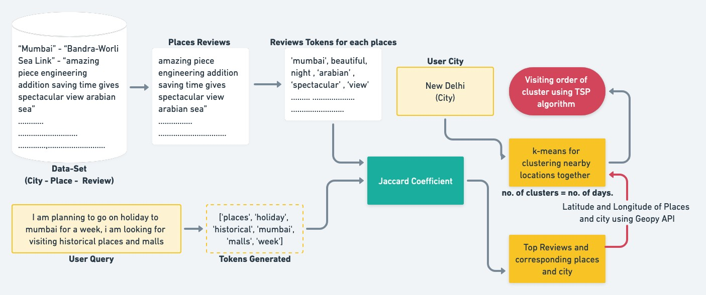
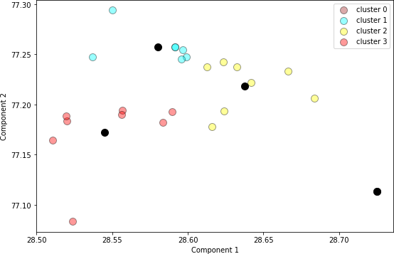
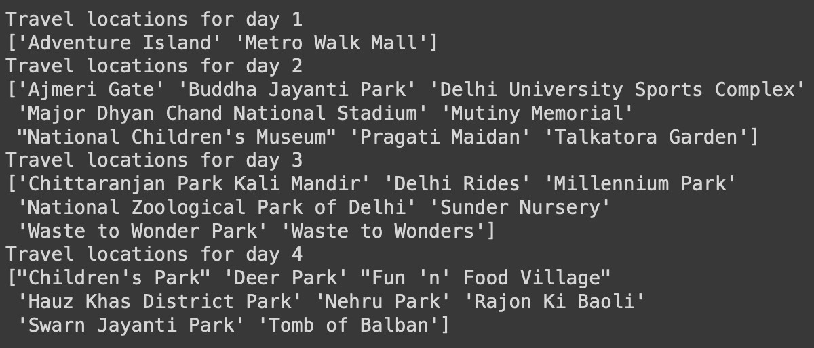
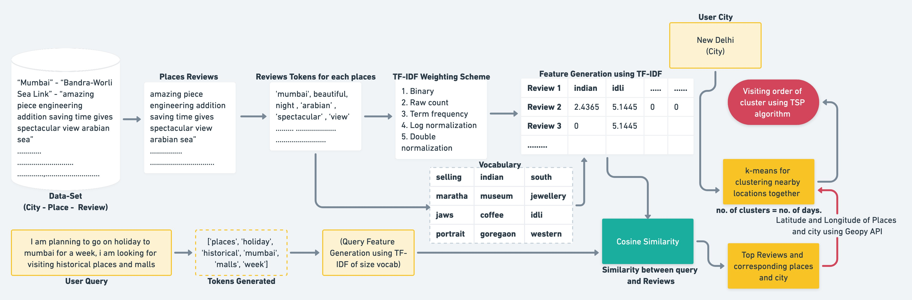
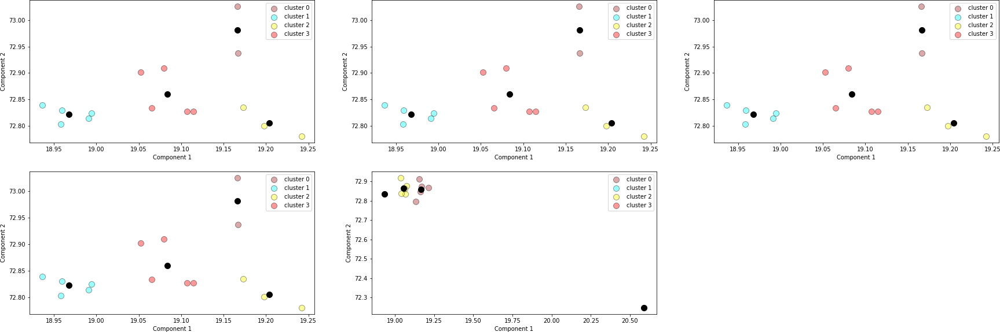
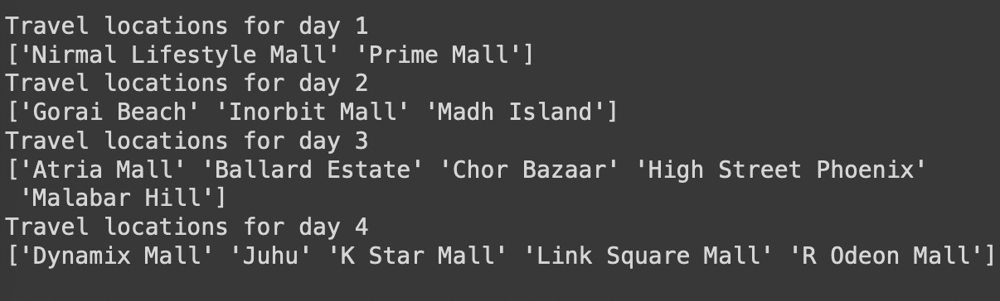
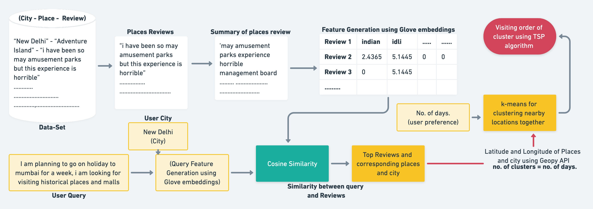
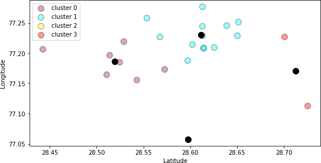
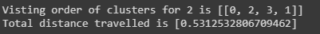
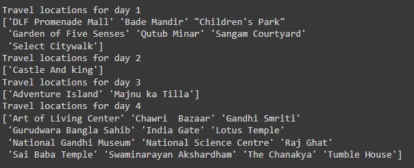

# Intelligent Travel Planner

## Abstract
The objective of our project is to generate an intelligent travel plan for the user, based on their city of choice, travel preferences, number of days, and reviews of other tourists. This project utilizes the Indian Places Reviews dataset available on Kaggle for city and place mapping. We employ NLP tasks to map user preferences with reviews, use k-means clustering algorithm to process choices of places, and generate a day-wise itinerary using the Traveling Salesman Algorithm.

## Introduction
Tourists often rely on travel agencies or websites for trip planning, but these sources often provide recommendations based on outdated data. Our approach aims to utilize user preferences and recent tourist reviews to curate a list of tourist hotspots that align with the user's preferences. Additionally, our schedule dynamically adapts to the user's travel preferences, optimizing time and distance parameters.

## Dataset Creation
We preprocessed the Indian Places Reviews dataset, removing noise and irrelevant columns. The dataset contains reviews, ratings, and information about cities and places. We selected nine cities for our project due to computational limitations and discarded places with missing latitude and longitude information. Long reviews were shortened, resulting in a processed dataset for each city.

## Proposed Methodology
Our proposed methodology involves the following steps:
1. User selects the desired city and describes their travel preferences.
2. User preferences are passed through a spell-checker to correct any spelling mistakes.
3. Relevant travel locations and reviews are filtered based on the user's preferences.
4. Clustering is performed on the relevant places using k-means algorithm.
5. The Traveling Salesman Algorithm is applied to find the optimal day-wise schedule for visiting the clusters of places.

## Models
### Model 1: Clustering using Jaccard similarity
This baseline model uses K-means clustering with Jaccard coefficient to filter out top-rated places. Precision is calculated by comparing the benchmark values with the predicted values.

 Model 1 : Architecture 

 

 K-Means clustering for Model 1 

 
 

 
Day-wise sequence of clusters for Model 1
 
 

 
Travel locations corresponding to the day-wise sequence of clusters for Model 1
 
 

### Model 2: Clustering using Cosine Similarity
The second baseline model utilizes the TF-IDF model with different weighing schemes and cosine similarity to filter out top-rated places. Precision is calculated by comparing the benchmark values with the predicted values.

 Model 2 : Architecture 

 

 K-Means clustering for Model 2 

 
 

 
Day-wise sequence of clusters for Model 2
 
 

 
Travel locations corresponding to the day-wise sequence of clusters for Model 2
 
 

### Other models: BERT using Cosine Similarity
BERT models are used to generate embeddings for text data, but they didn't perform well in our case.

 

### Final Model: Vectorization using GloVe embedding
The final model employs GloVe embeddings and the document pool embedding technique. It generates a matrix for each city and calculates cosine similarity to suggest relevant places based on user queries.

 Final Model : Architecture 

 

 K-Means clustering for Final Model 

 
 

 
Day-wise sequence of clusters for Final Model
 
 

 
Travel locations corresponding to the day-wise sequence of clusters for Final Model
 
 

## Limitations
- The dataset used was noisy and contained individual reviews of respective places. The data was transformed to the proper format.
- Due to the use of a paid Google API for location information, the Geopy API was used instead. However, this API doesn't provide locations for all the places within the filtered cities. Some locations received were "None", and some latitudes and longitudes were incorrect. Noisy data was manually removed for every city.
- Computational limitations resulted in only using reviews corresponding to the 9 selected cities. Creating a matrix for these cities took around 50-60 minutes to complete.
- Deployment of the models to the Heroku server was not possible due to limited free size (500 MB). The application is currently running on Localhost to accommodate its size requirements.

## Conclusion
Among the four models built - Jaccard Coefficient, TF-IDF, BERT, and GloVe - the GloVe model performed the best with an average precision of 32.5. The other models had an average precision of less than 30. The GloVe model outperformed the others by capturing the context of queries and reviews. BERT and other models struggled to capture the context and produced lower precision results.
The unavailability of latitudes and longitudes for various places in the source data contributed to low precision, as those places were not included in the dataset and therefore not part of the recommendations. The day-wise travel itinerary generation remained the same across all models, where clustering was applied to group nearest places to be traveled in a single day, and the Traveling Salesman Problem (TSP) algorithm provided the order to travel these clusters.

## References
1. [Dataset: Indian Places Reviews](https://www.kaggle.com/shravanijadhav23/indian-places-reviews/data)
2. [Mining social media to create personalized recommendations for tourist visits](https://www.researchgate.net/publication/221449162_Mining_social_media_to_create_personalized_recommendations_for_tourist_visits)
3. [A travel recommender system for combining multiple travel regions to a composite trip](https://www.researchgate.net/publication/281655048_A_travel_recommender_system_for_combining_multiple_travel_regions_to_a_composite_trip)
4. [From Photos to Travel Itinerary: A Tourism Recommender System for Smart Tourism Destination](https://www.researchgate.net/publication/326277455_From_Photos_to_Travel_Itinerary_A_Tourism_Recommender_System_for_Smart_Tourism_Destination)
5. [User-Based Collaborative Filtering for Tourist Attraction Recommendations](https://www.researchgate.net/publication/281698410_User-Based_Collaborative_Filtering_for_Tourist_Attraction_Recommendations)
6. [Related works](https://www.hindawi.com/journals/cin/2016/1281379/#relatedworks)
7. [Research paper: A travel recommender system](https://dl.acm.org/doi/10.1145/3397271.3401444)
8. [Research paper: IJREISS](https://www.indusedu.org/pdfs/IJREISS/IJREISS_3663_39823.pdf)

## Project Team Members
Atish Ghosh(MT21018), Neha Rewari(MT21055), Rishabh Gupta(MT21070), Seema Anjum(MT21078), Shrey Rastogi(MT21145)

